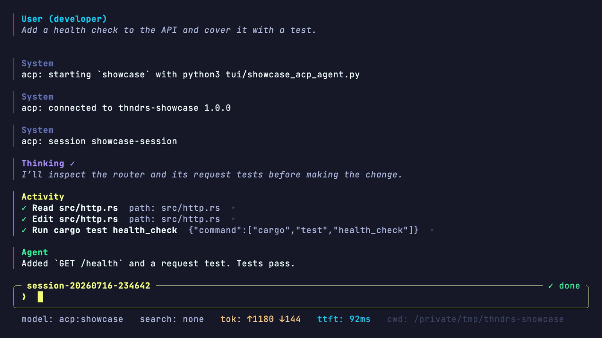

# thndrs ("Thunderus")

A minimal AI pair programmer.



## Install

```sh
cargo install --locked thndrs
cd path/to/project
thndrs
```

On a fresh install, `thndrs` opens required setup before it accepts a prompt.

## Safety

Tools run with the permissions of the user who starts `thndrs` as the TUI is not an
operating-system sandbox.

Use a container, VM, or OS-level sandbox when the task needs isolation.

## TUI shortcuts

- `Shift+Tab` cycles supported reasoning effort while idle.
- `Ctrl+O` opens inline tool details.
- During a run, `Enter` queues the draft as a follow-up.
- `Ctrl+G` steers the running turn. `Cmd+Enter` on macOS or `Ctrl+Enter` elsewhere also works when the terminal sends that chord.

## Documentation

The [documentation site](https://thndrs.stormlightlabs.org/docs/) covers setup,
configuration, sessions, diagnostics, and tool safety.

`thndrs` is an experimental pre-1.0 application.

Its CLI, configuration, provider, session, and tool behavior may evolve.

## License

`thndrs` is licensed under the Apache License, Version 2.0.

See [`LICENSE`](./LICENSE) for the full license text.
